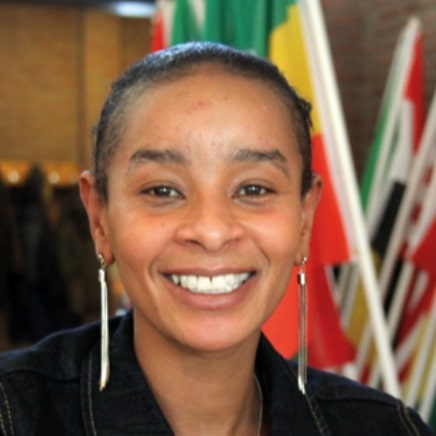
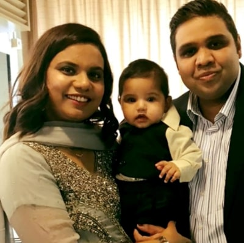
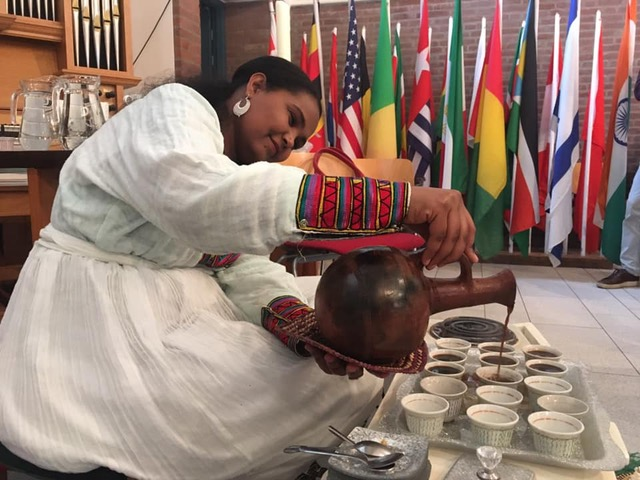

We are a group of young and old people with different nationalities. We meet each other with the purpose of getting to know each other and Jesus (better) and following him in our city, Nieuwegein. We meet every Sunday for the CC-Meeting. Then we celebrate that we are one in Christ by eating together, singing, praying and listening to God’s Word. In addition, we meet in a casual way at home, through bible study groups, alpha courses or in other ways.

*We are a ‘spiritual home’ with all ‘nations’ in Nieuwegein.*

  

    <button type="button" data-bs-target="#carouselExampleIndicators" data-bs-slide-to="0" class="active" aria-current="true" aria-label="Slide 1"></button>
    <button type="button" data-bs-target="#carouselExampleIndicators" data-bs-slide-to="1" aria-label="Slide 2"></button>
    <button type="button" data-bs-target="#carouselExampleIndicators" data-bs-slide-to="2" aria-label="Slide 3"></button>
  

  

    

        

            

                

                

"I met somebody from Cross Culture on the football pitch. Immediately I experienced that this encounter was an answer from God to my questions. My heart spoke. Often, I was restless and lonely and tried to suppress that restlessness. That did not work out. But now God has taught me to find peace and tranquility with Him. He has now become my Father. I can no longer go to church without my brothers and sisters. I look no longer to my circumstances alone, the difficulties, but I put my life in the hands of Jesus. My second name is Ruth. I experience that as no coincidence. Ruth came from a different country but still started serving the God of the new country." - <strong>Judy Kamande</strong>

            

        

    

    

        

            

                

                

"Cross Culture started out of necessity. We met many migrants in Nieuwegein, often with a Christian background, who could not find a "spiritual home" anywhere. The audience in Cross Culture is enormously diverse: one visitor comes from the Syrian Orthodox tradition, another from an Angolan Pentecostal church - to name just a few extremes. Everyone can keep their individuality. And yet we are also one together. It really is a beautiful place, multicolored, warm and open, a home for people from all cultures!" - <strong>Dirk de Bree</strong>

            

        

    

    

        

            

                

                

"With my husband, I came to the Netherlands in 2014. We had to flee due to great insecurity in our home country. After having lived in all kinds of AZCs for years, we were assigned a house in Galecop, Nieuwegein. The first time was very difficult, but luckily we came in contact with Theo Vreugdenhil and Cross Culture. When we joined the Cross Culture group holiday in 2016, everything changed. That was a great week! We experienced the love of God in the conversations with the other participants. We shared our experiences during the talks in the late hours. We noticed that people felt our pain and really wanted to help us. From that moment the ice was broken - as the Dutch say. Cross Culture has become our family and our son Moses has also been baptized there!" - <strong>Sana & Sameer Sarfraz</strong>

            

        

    

  

  <button class="carousel-control-prev" type="button" data-bs-target="#carouselExampleIndicators" data-bs-slide="prev">
    
    Previous
  </button>
  <button class="carousel-control-next" type="button" data-bs-target="#carouselExampleIndicators" data-bs-slide="next">
    
    Next
  </button>

# Multicultural & Intercultural
We are a multicultural church. Christians from all cultures and from different churches are welcome. The native language is Dutch, but often it is translated or you can speak people in your own language. We sing songs from different cultures and traditions.

------------------------------------------------------------------------------------------------------------------------

# Core Values
## Connection
In our activities we learn to know each other. There is plenty of space for meeting and conversation. Everybody is equal; you do not have to feel alone. Even with our Sunday service, we involve as many people as possible. Together we are a new family. People from all over, brought together by our faith and the love of Jesus that helps them to overcome their fears, in a world that sometimes feels so divided or dark.

## Hospitality
Guests are welcome to our activities. We actively invite new people because we know that through these meetings people feel as if they are in God’s home. Would you like to come by? Welcome!

## Sharing
We can learn a lot from each other because we are so different. Everyone can contribute in his/her own way. We share our food, our life stories, borrow cars, pray for each other and whenever possible we help each other with chores, translation or clothing. We also share food with 25 different people in our city. Sharing is normal when you become a family, right?

## Our Faith
Biblical education is very important for us: in Bible groups and on Sunday services. Bible verses are explained via sermon. We focus on: a) People who are Christians b) People who have just become Christians, and c) People who are interested in Christian faith.

------------------------------------------------------------------------------------------------------------------------

  

    

      <strong>Leiderschapsteam</strong>
      <ul>
        <li>Maarten Atsma (voorzitter)</li>
        <li>Debbie Sieders</li>
        <li>Michele Atsma</li>
        <li>Urbain Nkanga</li>
        <li>Sameer Sarfraz</li>
        <li>Linda Hoegée</li>
        <li>Jaron Jongeneel</li>
        <li>Theo Vreugdenhil</li>
        <li>Wiljanne Vreugdenhil</li>
      </ul>
    

    

      <strong>Stuurgroep</strong>
      <ul>
        <li>Theo Vreugdenhil (pastor)</li>
        <li>Cornelis van Dis (voorzitter & diaken)</li>
        <li>Gertjan Glismeijer (predikant Hervormd Vreeswijk)</li>
        <li>Gertjan van Eijk (ouderling Ankergemeente)</li>
      </ul>
    

  

------------------------------------------------------------------------------------------------------------------------

<h1 id="origin">Origin</h1>
In December 2011, the first meeting was organized between members of the congregation of Hervormd Vreeswijk (PKN) and immigrant Christians from the network of members of congregation. Soon this meeting (we called it a Cross Culture Meeting) proved to fulfill a need. The first year we met every six weeks, later once a month. Since February 2014 twice a month and from November 2017, we will meet every week on sundays.

It has now become a great platform for Christians and ‘seekers’ from many countries (we have already listed more than 30 countries of origin), with a committed group of about 50 adults and 10 children.

In Nieuwegein about 25% of inhabitants are immigrants. Many of them are Christians. When they come to the Netherlands, often they have no connection with Dutch churches, but they need a church. For them, Cross Culture Nieuwegein is a wonderful place to be able to find a spiritual home in this new country and to be helped to feel home in the Netherlands.

------------------------------------------------------------------------------------------------------------------------

<h1 id="counselors">Code of Conduct</h1>

Helma (<helma.vanderneut@gmail.com> / [06 28637662](tel:+31628637662)) and Mark van der Neut (<mark_neut@hotmail.com> / [06 37286171](tel+31637286171)) are confidential advisers for Cross Culture Nieuwegein. You can contact them with questions, suspicions and reports of transgressive behavior within Cross Culture. You can contact them in the case you experienced undesirable behavior. This includes discrimination, physical and psychological violence or bullying. You can also contact a counselor if you suspect irregularities with money. These counselors work confidential unless they hear about a serious crime (in which case repetition is expected). They are a listening ear and advise you on what to do next.

More information about the confidential advisers and our code of conduct can be found <a href="../assets/doc/veiligheid.pdf" download>here</a> (Dutch, use e.g. Google Translate).